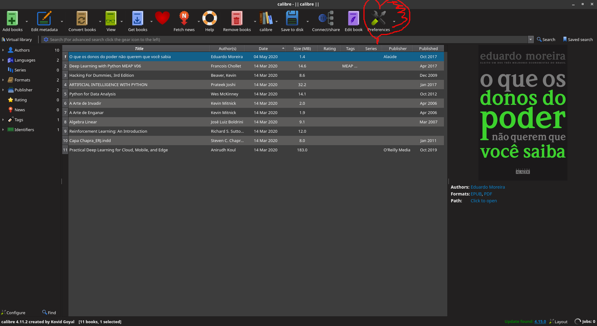
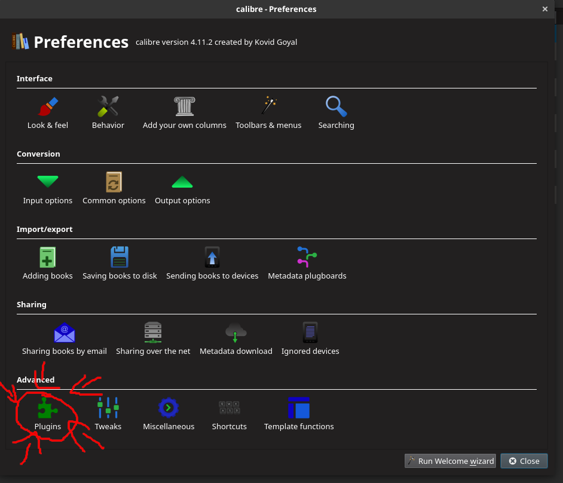
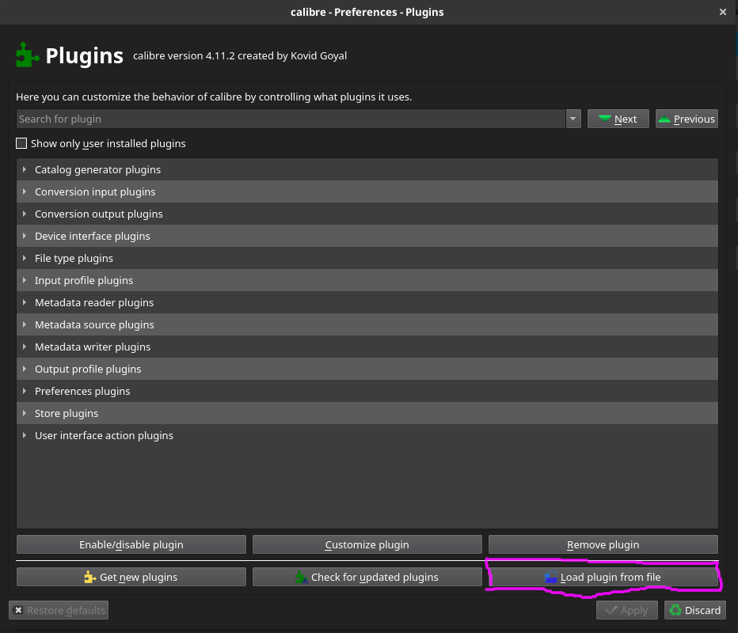
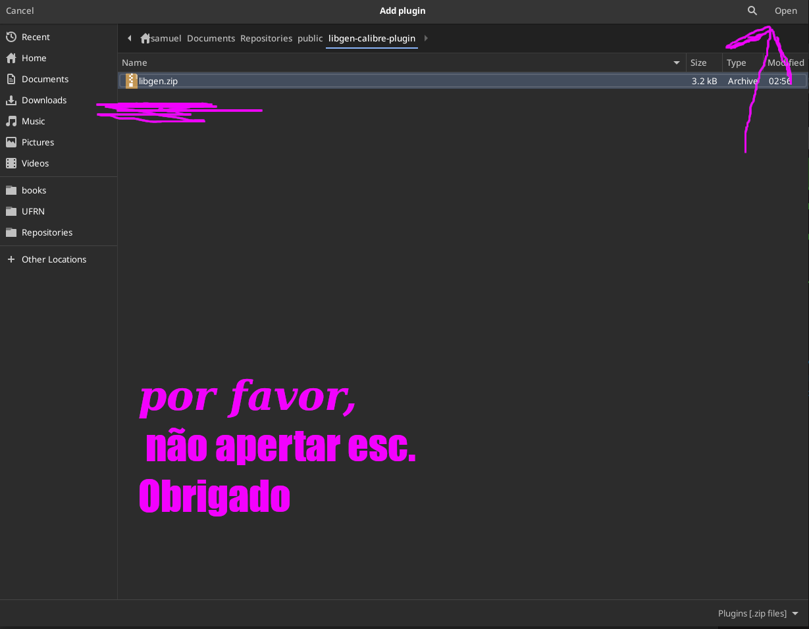
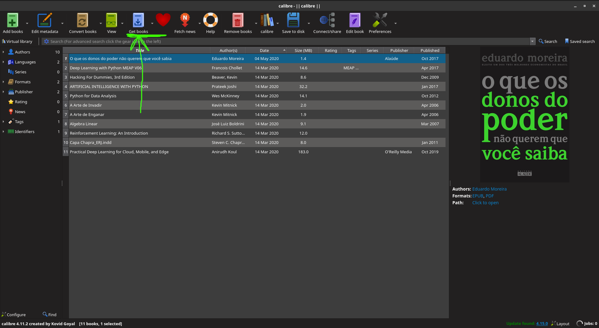
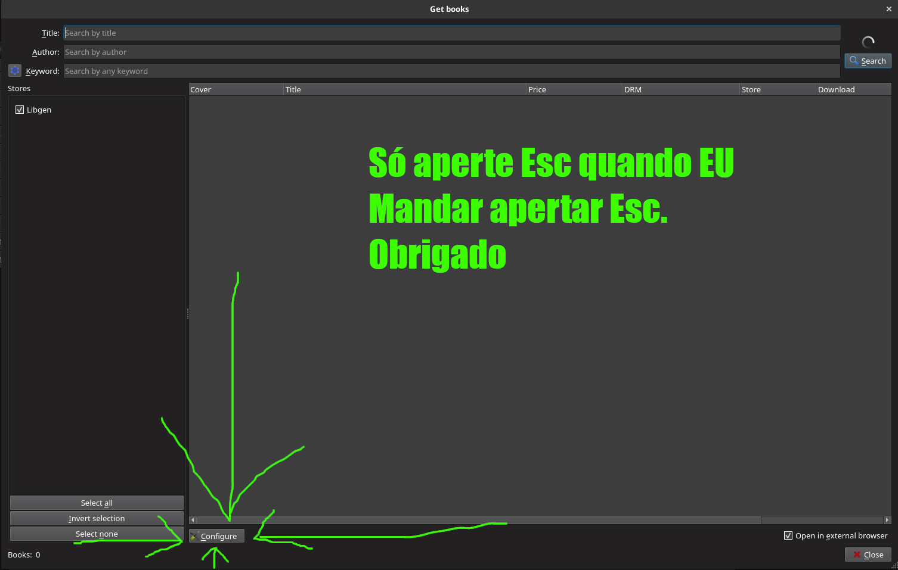
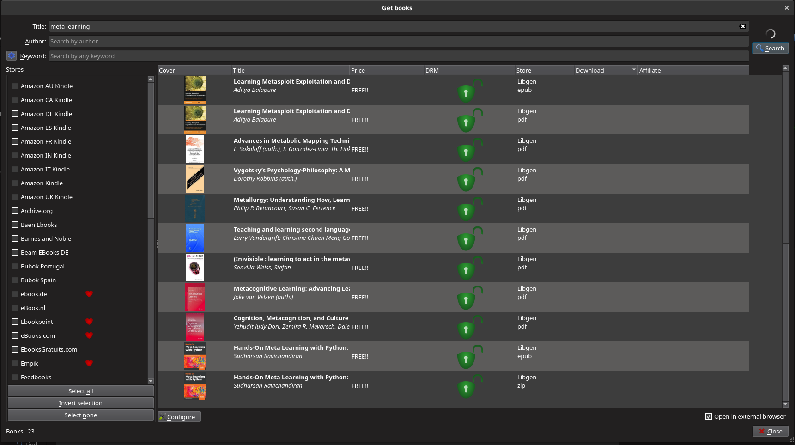
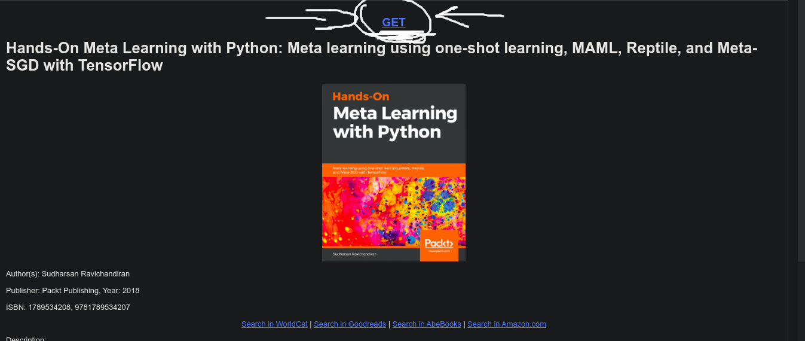

# MY-libgen-calibre-plugin
Libgen calibre plugin é um plugin feito para o projeto [Calibre](https://github.com/kovidgoyal/calibre).
Através dele você pode pesquisar e baixar livros, artigos que esta presente no
libgen (pirataria de livros e artigos da mais boa qualidade ☠ )‍.

### Porque mais um plugin do libgen ?
Óbvio, existem outros plugins, mas o meu web scraping é mais rápido, pega mais informações e funciona.  
(por enquanto. Web scraping é muita vezes um corno job) 

### referências
tomei como base nesses códigos fontes:  
https://github.com/fallaciousreasoning/CalibreLibgenStore  
https://github.com/harrison-broadbent/libgen-api  
https://github.com/kovidgoyal/calibre

## Como instalar o plugin: 
__Abra o Calibre  e clique em preferências:__
 

Depois clique em __Plugins__:

clique em __carregar plugin através de um arquivo__:

 
 
 
vai até aonde você baixou o arquivo __libgen.zip__ e clique em __abrir__:

Agora vamos configurar o calibre para baixar os livros, artigos, do libgen.  
Vai em __Obter livros__: 

Clique em __configurar__:

Nossa, essa é a parte mais difícil, mas se você chegou até aqui, eu sei que você consegue.  
Você tem 3 opções: __Pobre__, __Classe média__, __seu lugar não é aqui__
- __Pobre:__ recomendo desativar as outras lojas e só deixar só o libgen ativado.
Para isso clique me __None__ na setinha amarela, depois digite __libgen__ no traço azul
e clique em procurar, depois clique no box onde a setinha rosa está indicado, para ativar a loja libgen

- __Classe Média__: recomendo você deixar as outras lojas ativadas,
só procure por __libgen__ e marque a caixinha que na na setinha __rosa__

- __seu lugar não é aqui__: feche essa aba.

Agora para verificar se tudo correu bem faça uma busca, como por exemplo __meta learning___, se
você seguiu a opção pobre, então deve aparecer mais ou menos  o seguinte resultado:

__OBS:__ Quando você clicar no livro desejado, deverá abrir uma página no seu navegador,
onde você só precisa clicar no GET bem grandão como no meu:

